# Beauty & Fashion AI — vLLM Learning Project

> **한국어:** [README_KO.md](README_KO.md)

> **MBO Learning Project(FY27-Q2)**  
> This project supports an **MBO (Management By Objectives)** goal: install **vLLM (`vllm-cpu`)** on **Cloudera AI** (Cloudera Data Service on-premise 1.5.5), build and test a **Beauty Fashion Application** in a Session, and understand the **full AI inference workflow** — from environment setup → model serving → API integration → end-to-end testing → Application deployment.

---

## Project Overview

The goal is to install **vLLM** on **Cloudera AI**, build a **Beauty Fashion chatbot application**, and understand the **end-to-end process** of running an AI inference service.

| Phase | What you learn |
|-------|----------------|
| **Environment setup** | Create a Cloudera AI Session, choose a Runtime, complete Kerberos authentication |
| **Install & run vLLM** | Install `vllm-cpu`, start the OpenAI-compatible API server (port **8001**) |
| **Build the application** | FastAPI + chatbot UI, connected to vLLM via `/api/chat` |
| **Test the service** | Health checks, chat API calls, end-to-end validation |
| **Understand deployment** | Session vs. Cloudera AI Application (`cdsw-build.sh` / `cdsw-run.sh`) |

**Target environment:** Cloudera Data Service on-premise 1.5.5 · Cloudera AI · Python 3.11 Standard · CPU (non-GPU)

---

## Install vLLM on Cloudera AI

The steps below walk through creating a CPU-based Session in **Cloudera AI Workbench**, installing **vllm-cpu 0.26.0**, and verifying that it works.

### Step 1. Hadoop Authentication (Kerberos login)

Kerberos authentication is required before you can access Hadoop cluster data from Cloudera AI.

1. Left menu → **User Settings**
2. Open the **Hadoop Authentication** tab
3. Sign in with Kerberos

You should see a message like **"Currently authenticated as …"**.

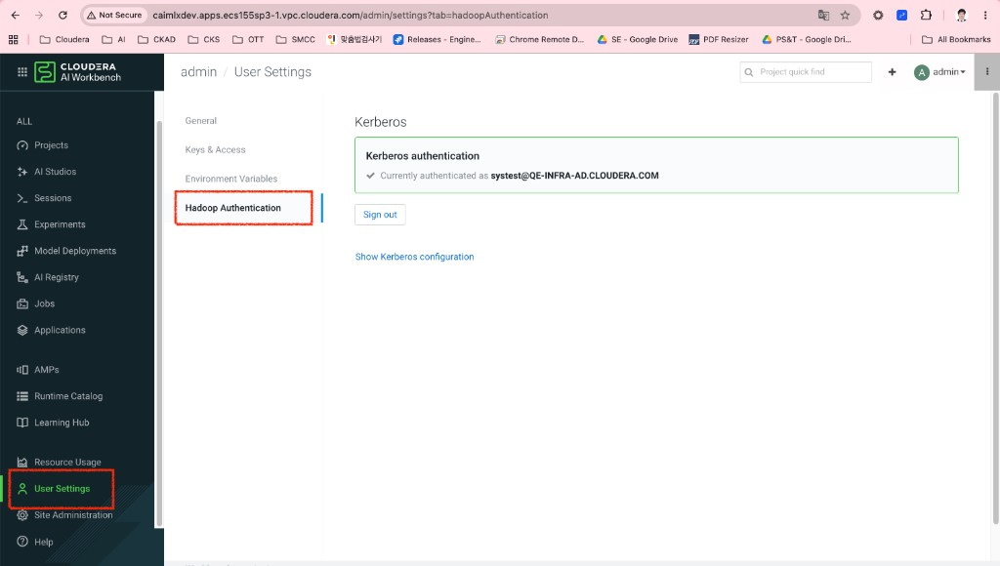

> **Note:** The screenshot shows authentication as `systest@QE-INFRA-AD.CLOUDERA.COM`. After login, Sessions and Applications can use Hadoop/Spark resources. This guide uses a CPU Session only (Spark disabled).

---

### Step 2. Verify the Runtime Catalog

Confirm that the Runtime Image is **Python 3.11 Standard**.

1. Left menu → **Runtime Catalog**
2. Filter by Editor: **PBJ Workbench**, Kernel: **Python 3.11**
3. Confirm **Standard Edition** is selected (Default)

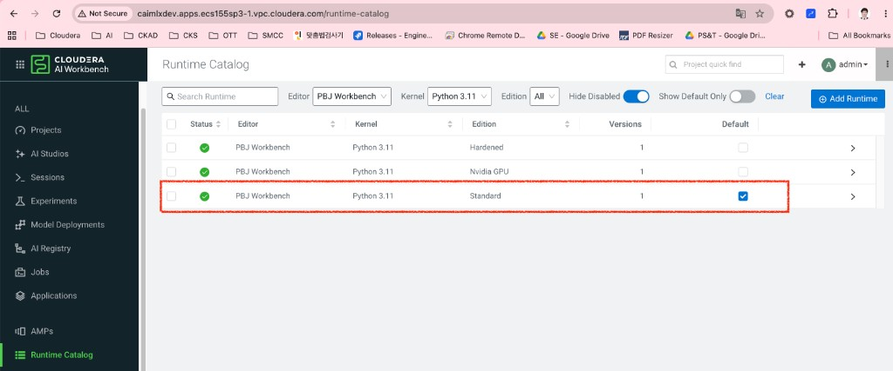

> **Note:** Use **Standard Edition**, not GPU Edition. The CPU build (`vllm-cpu`) runs without an NVIDIA GPU. Runtime image: `ml-runtime-pbj-workbench-python3.11-standard:2026.04`

---

### Step 3. Create a project

Create a project to hold your vLLM setup and application code.

1. Left menu → **Projects** → **New Project**
2. Enter a project name (e.g. `vLLM-Test`)

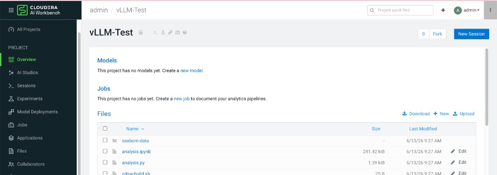

> **Note:** Sessions, Applications, and project files are managed inside this project. You can clone this repo: `https://github.com/jshin-jackson/beauty-fashion-vllm`

---

### Step 4. Create a CPU Session

Start a Session for interactive work (terminal, notebooks).

1. In the project → **New Session**
2. Use these settings:

| Setting | Value |
|---------|-------|
| Session Name | `vLLM-T1` (any name) |
| Editor | PBJ Workbench |
| Kernel | Python 3.11 |
| Edition | Standard |
| Resource Profile | **2 vCPU / 8 GiB** (CPU) |
| Enable Spark | Off |

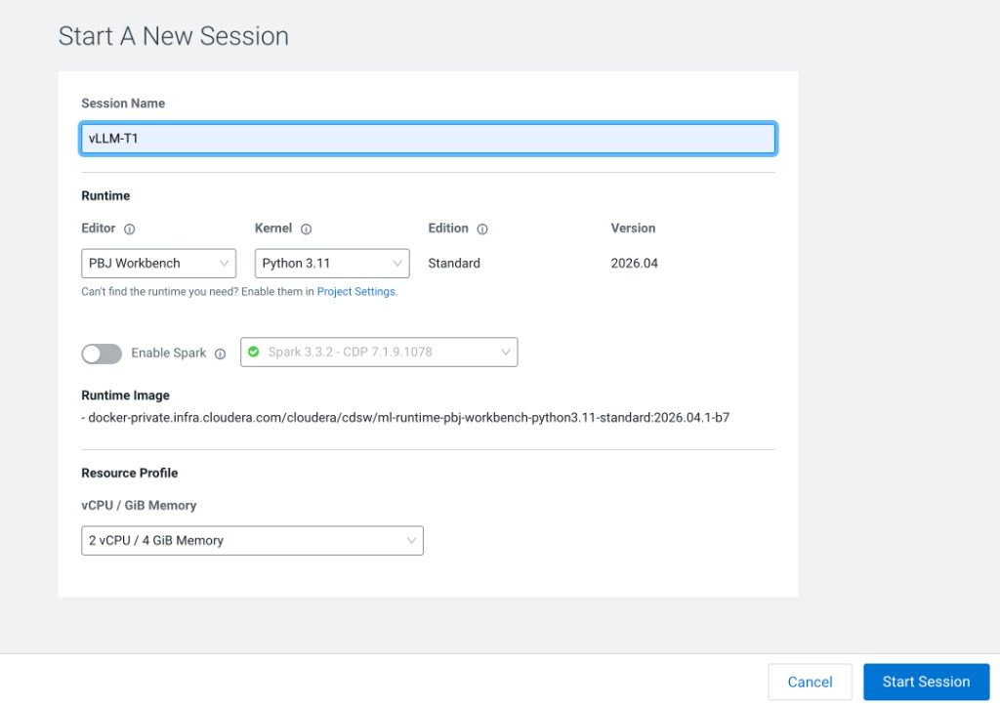

> **Note:** Use the **2 vCPU / 8 GiB** CPU profile (no GPU). This is the recommended setup for CPU inference with the small **0.5B** model (`Qwen/Qwen2.5-0.5B-Instruct`).

---

### Step 5. Open Terminal Access

Once the Session is **Running**, open a terminal.

1. Top right of the Session screen → **Terminal Access**
2. A new terminal window opens

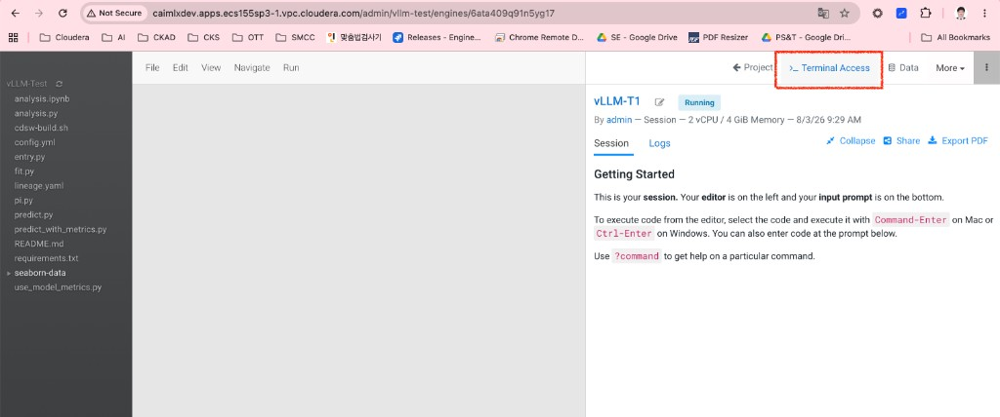

> **Note:** The **Cloudera AI Terminal** opens separately from the PBJ Workbench editor. Install and run vLLM from this terminal. Confirm the Session shows **Running (2 vCPU / 8 GiB)**.

---

### Step 6. Create a Python virtual environment and fix pip

In Cloudera AI, the default `PIP_USER` setting can conflict with virtual environments. Follow these steps:

```bash
python3 -m venv ~/vllm_cpu
source ~/vllm_cpu/bin/activate

# Required in CDSW/CML to avoid pip --user errors
unset PIP_USER
export PIP_USER=0

pip install --upgrade pip
```

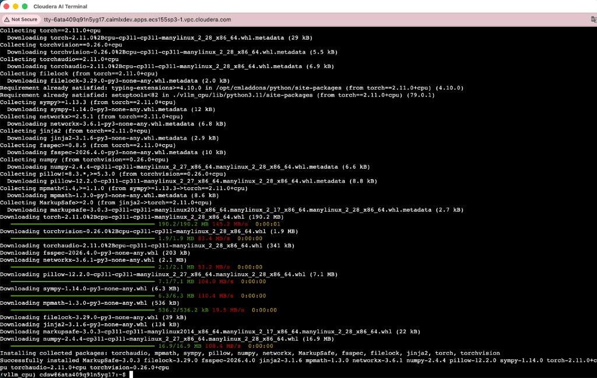

> **Note:** If you see `(vllm_cpu)` in the prompt, the virtual environment is active. If you get `ERROR: Can not perform a '--user' install`, run `unset PIP_USER && export PIP_USER=0` and retry pip. You should see pip upgraded (e.g. to 26.2).

---

### Step 7. Install vllm-cpu

Install the CPU-only vLLM package:

```bash
pip install vllm-cpu
```

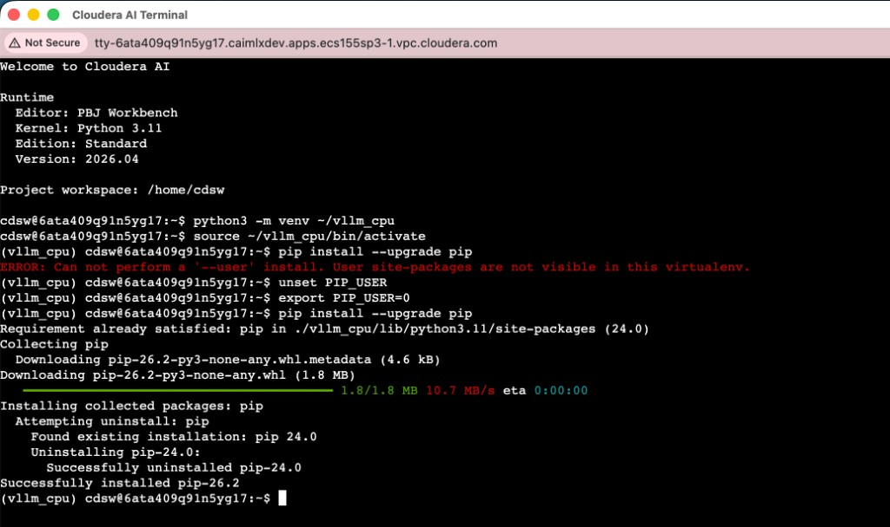

> **Note:** This installs **vllm-cpu 0.26.0** along with CPU PyTorch packages (`torch==2.11.0+cpu`, `torchvision`, `torchaudio`). Use **`vllm-cpu`**, not the CUDA build (`vllm`), for CPU Sessions.

---

### Step 8. Verify PyTorch CPU setup

Confirm the installation is correct:

```bash
python - <<EOF
import torch
print(torch.__version__)
print(torch.cuda.is_available())
EOF
```

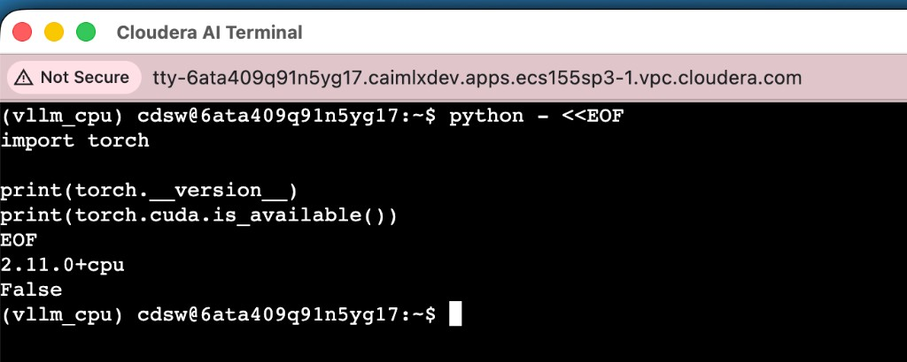

> **Note:** Expected output: `2.11.0+cpu` and `False` (CUDA not used). If you see `True`, a GPU build was installed — recreate the venv and reinstall `vllm-cpu`.

---

### Step 9. Start the vLLM server

Start the OpenAI-compatible API server:

```bash
python -m vllm.entrypoints.openai.api_server \
  --model Qwen/Qwen2.5-0.5B-Instruct \
  --host 0.0.0.0 \
  --port 8001 \
  --gpu-memory-utilization 0.35 \
  --max-model-len 2048 \
  --max-num-seqs 1
```

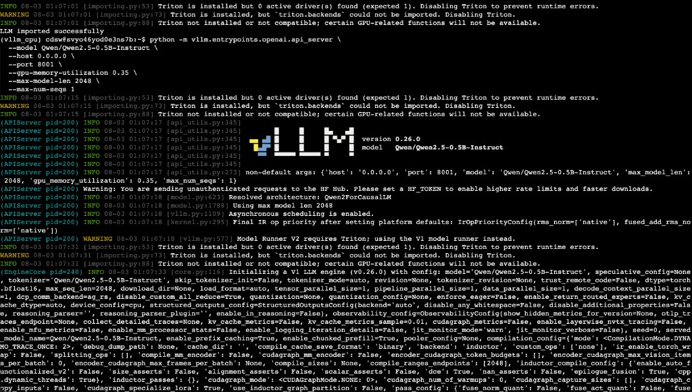

> **Note:** vLLM 0.26.0 initializes with `device_config=cpu`. On CPU, `--gpu-memory-utilization 0.35` means **RAM reservation ratio** (8 GiB × 0.35 ≈ 2.8 GiB). `--max-num-seqs 1` limits concurrent requests for stability. Triton warnings on CPU are normal and can be ignored.

---

### Step 10. Confirm the server is ready

When the log shows `Application startup complete.`, the server is ready for requests.

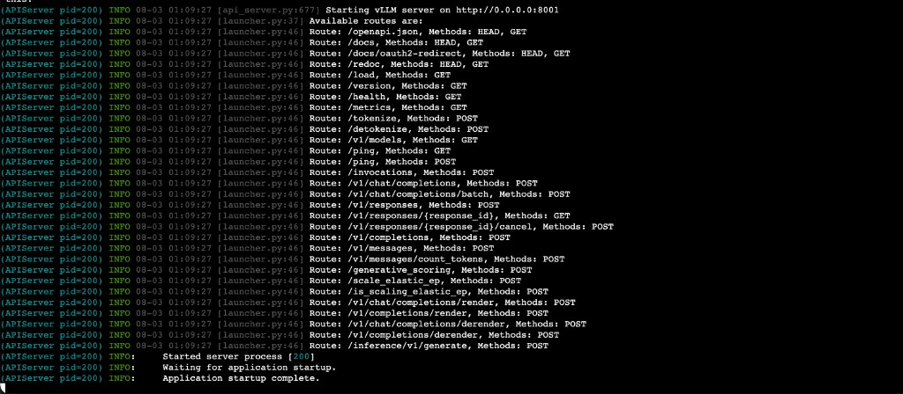

> **Note:** OpenAI-compatible endpoints such as `/v1/models` and `/v1/chat/completions` are available at `http://0.0.0.0:8001`. The FastAPI app runs separately on port **8002**.

---

### Step 11. Test the API

In a **new terminal** (or another Terminal Access window in the same Session):

```bash
curl http://127.0.0.1:8001/v1/models
```

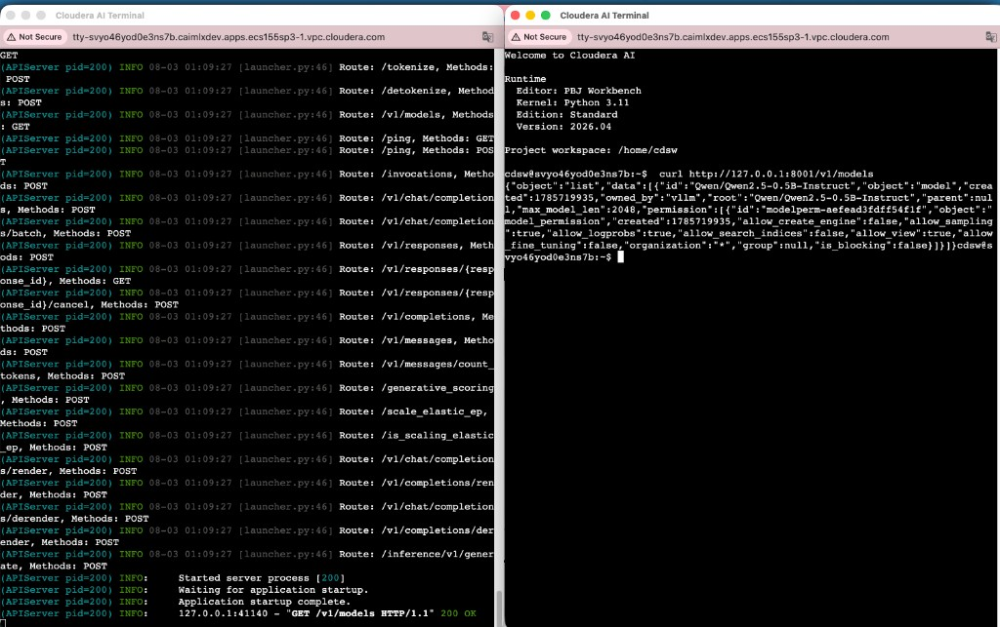

> **Note:** If the JSON response includes `"id": "Qwen/Qwen2.5-0.5B-Instruct"`, vLLM install, startup, and model load all succeeded. The vLLM terminal should log `GET /v1/models HTTP/1.1" 200 OK`.

---

## Test the Beauty Fashion App (Steps 12–14)

After Steps 1–11, use **two terminals** to run the app and test the chat API.

| Service | Port | Terminal |
|---------|------|----------|
| vLLM API | **8001** | Terminal 1 |
| FastAPI app | **8002** | Terminal 2 |

---

### Step 12. Run the vLLM server (Terminal 1)

Activate the virtual environment and start vLLM on port **8001**:

```bash
source ~/vllm_cpu/bin/activate

python -m vllm.entrypoints.openai.api_server \
  --model Qwen/Qwen2.5-0.5B-Instruct \
  --host 0.0.0.0 \
  --port 8001 \
  --gpu-memory-utilization 0.35 \
  --max-model-len 2048 \
  --max-num-seqs 1
```

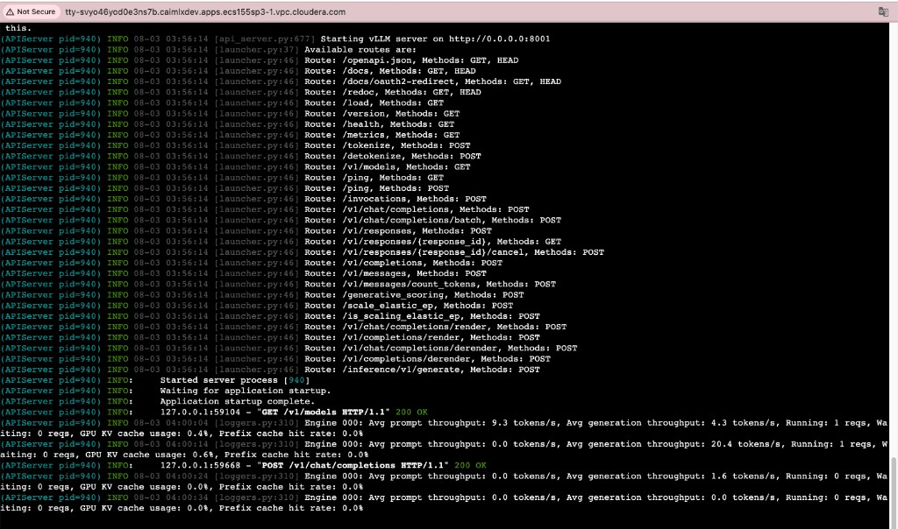

> **Note:** Look for `Starting vLLM server on http://0.0.0.0:8001` and `Application startup complete.`. When the FastAPI app sends `/api/chat` requests, you should see `POST /v1/chat/completions HTTP/1.1" 200 OK` and **Avg generation throughput** (~4–5 tokens/s). Keep this terminal running.

---

### Step 13. Run the FastAPI app (Terminal 2)

Open a **new Terminal Access** window and start the Beauty Fashion App on port **8002**:

```bash
cd ~/beauty-fashion-vllm && git pull
source ~/vllm_cpu/bin/activate
unset PIP_USER && export PIP_USER=0
pip install -r requirements/base.txt

export VLLM_BASE_URL=http://127.0.0.1:8001/v1
export MODEL_NAME=Qwen/Qwen2.5-0.5B-Instruct
uvicorn app.main:app --host 0.0.0.0 --port 8002
```

Health check:

```bash
curl http://127.0.0.1:8002/api/health
```

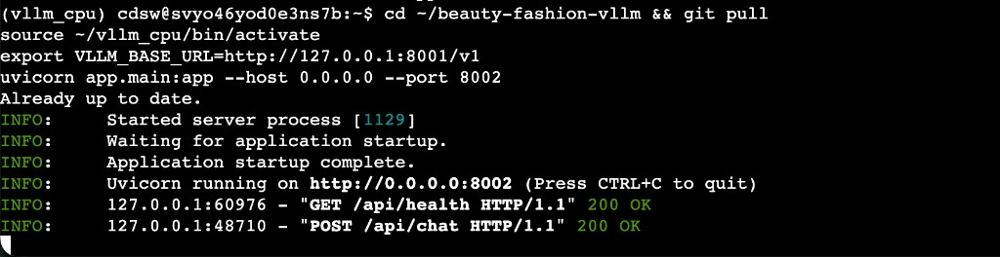

> **Note:** `Uvicorn running on http://0.0.0.0:8002` means the app is up. `GET /api/health HTTP/1.1" 200 OK` confirms connectivity to vLLM on port 8001. Activate `(vllm_cpu)` before `pip install` to avoid **Permission denied** errors.

> **Permission denied:** Activate the venv first → `source ~/vllm_cpu/bin/activate`

> **pip dependency conflicts:** Keep versions compatible with vllm-cpu:  
> `pip install "fastapi[standard]>=0.133.0,<0.137.0" "uvicorn[standard]>=0.31.1" python-dotenv`

---

### Step 14. Test the chat API

With uvicorn still running in Terminal 2, send a fashion question from another terminal:

```bash
curl -X POST http://127.0.0.1:8002/api/chat \
  -H "Content-Type: application/json" \
  -d '{"message": "The weather in Korea is extremely hot today. I am planning to meet a friend later - could you recommend an outfit for me?"}'
```

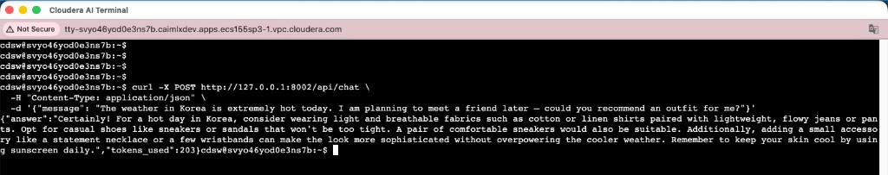

> **Note:** A JSON response with `"answer"` (fashion recommendation) and `"tokens_used"` means the **full Beauty Fashion App stack works**. Flow: `curl → FastAPI :8002/api/chat → vLLM :8001/v1/chat/completions → Qwen2.5-0.5B-Instruct`. On CPU, responses may take tens of seconds.

**Example success response:**

```json
{
  "answer": "Certainly! For a hot day in Korea, consider wearing light and breathable fabrics...",
  "tokens_used": 203
}
```

**Browser UI test** (if the Session exposes the port):

```
http://127.0.0.1:8002/
```

Use the example question buttons or type your own message and send.

> **Important:** Stopping the Session stops both vLLM and the app.

---

## Deploy the Beauty Fashion App on Cloudera AI

After a successful Session test (Steps 12–14), you can deploy the app as a long-running **Application**.

### Option A — Session (summary)

Follow **Steps 12–14**. Ports: vLLM **8001** + FastAPI **8002**.

> **address already in use:** Check port conflicts with `ss -tlnp | grep -E '8001|8002'`

---

### Option B — Application deployment (recommended)

Use the **Applications** menu to run the web app continuously. `cdsw-build.sh` and `cdsw-run.sh` start vLLM and FastAPI together.

**1. Clone the project**

```bash
git clone https://github.com/jshin-jackson/beauty-fashion-vllm.git
cd beauty-fashion-vllm
```

**2. Create an Application**

| Setting | Value |
|---------|-------|
| Name | `beauty-fashion-ai` |
| Script | `cdsw-run.sh` |
| Runtime | Python 3.11 Standard |
| Resource Profile | 2 vCPU / 8 GiB (CPU) |

**3. Click Create Application** → open the generated HTTPS URL to use the chatbot UI

---

## Learning Path

| Step | File | Topic |
|------|------|-------|
| 1 | `notebooks/01_vllm_basics.ipynb` | vLLM concepts, server startup, API calls |
| 2 | `notebooks/02_inference_params.ipynb` | Experiment with temperature, top_p, max_tokens |
| 3 | `notebooks/03_cloudera_intro.ipynb` | Cloudera AI structure, Application deployment |
| 4 | `app/main.py` + `app/static/index.html` | Fashion chatbot app |

---

## Project Structure

```
beauty-fashion-vllm/
├── docs/images/             # Setup & app test screenshots (Steps 1–14)
├── app/
│   ├── main.py              # FastAPI server
│   ├── config.py            # Environment config
│   └── static/index.html    # Chatbot UI
├── notebooks/               # Learning notebooks
├── scripts/start_vllm.sh    # Start vLLM (Session)
├── cdsw-build.sh            # Application build
├── cdsw-run.sh              # Application run
├── requirements/
│   ├── base.txt             # FastAPI dependencies
│   └── cloudera.txt         # Includes vllm-cpu
└── .env.cloudera.example    # Environment variable template
```

---

## vLLM Concepts (Quick Reference)

| Concept | Description |
|---------|-------------|
| **PagedAttention** | Manages GPU/CPU memory in pages → handles more concurrent requests |
| **Continuous Batching** | Processes new requests as they arrive |
| **OpenAI-compatible API** | `/v1/chat/completions` — use the OpenAI SDK as-is |
| **KV Cache** | Reuses previous Key/Value pairs → faster responses |
